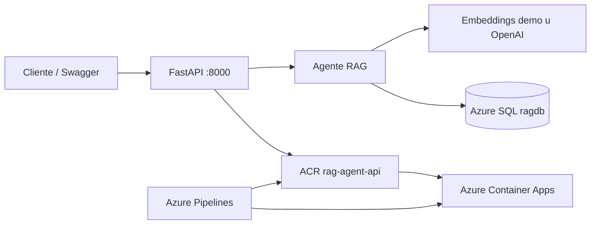
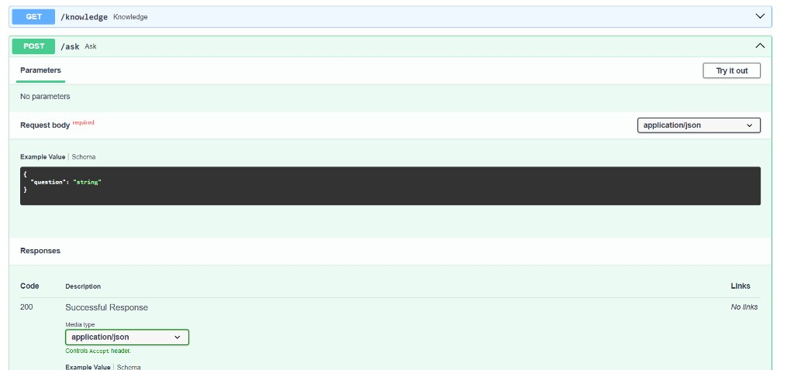
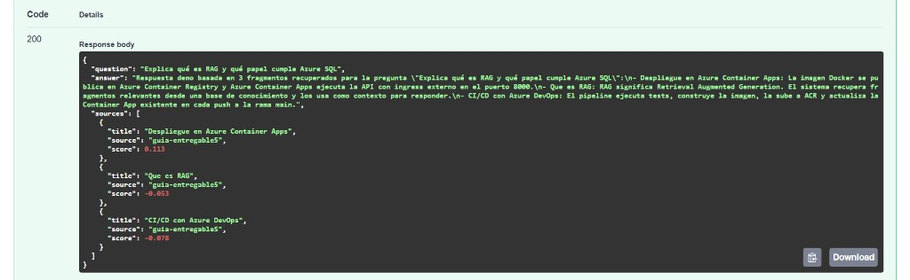
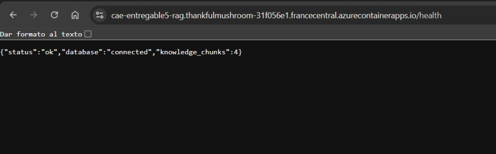
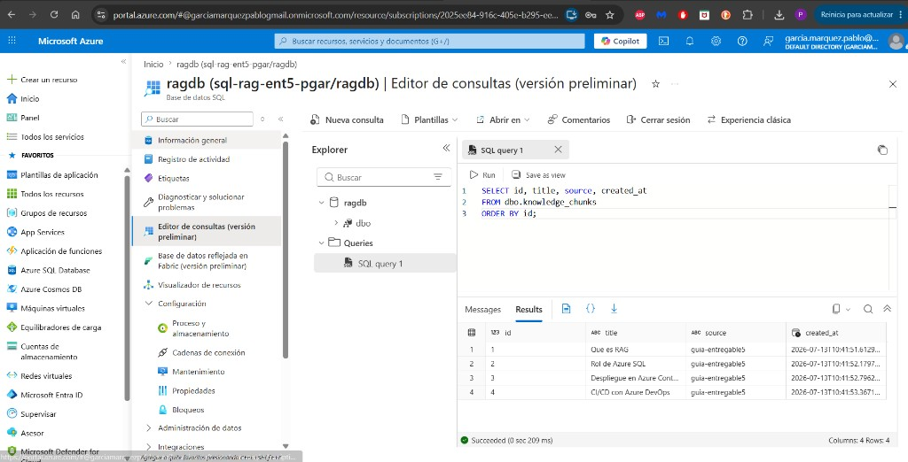
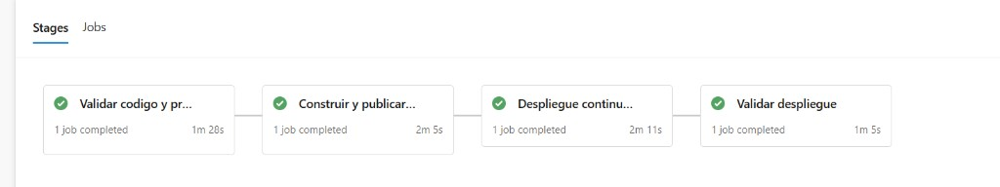
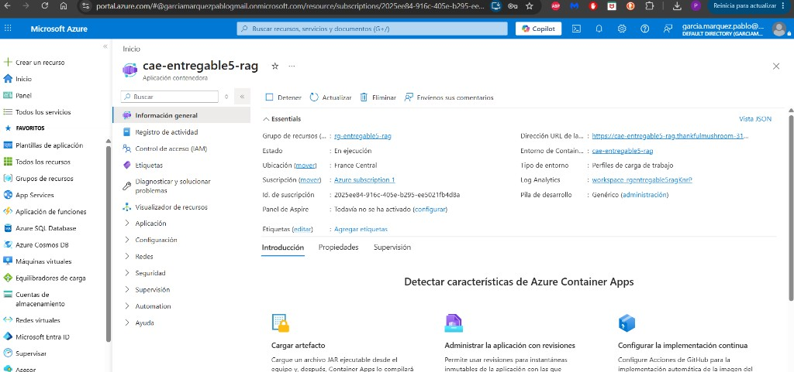
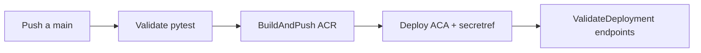

# RAG Agent Azure — Entregable 5

API **FastAPI** con arquitectura **RAG** (Retrieval Augmented Generation): recupera fragmentos desde **Azure SQL**, genera la respuesta y se despliega en **Azure Container Apps** mediante un pipeline de **Azure DevOps** (ACR + CI/CD).

**Repositorio:** [github.com/Sarajesko/rag-agent-azure](https://github.com/Sarajesko/rag-agent-azure)

---

## Índice

1. [¿Para qué sirve?](#para-qué-sirve)
2. [Qué incluye](#qué-incluye)
3. [Arquitectura](#arquitectura)
4. [Capturas](#capturas)
5. [Estructura](#estructura)
6. [Requisitos](#requisitos)
7. [Arranque rápido (elige un modo)](#arranque-rápido-elige-un-modo)
8. [Modo A — Local con Python](#modo-a--local-con-python)
9. [Modo B — Docker Compose](#modo-b--docker-compose)
10. [Base de conocimiento (Azure SQL)](#base-de-conocimiento-azure-sql)
11. [API REST](#api-rest)
12. [Ejemplos curl](#ejemplos-curl)
13. [Tests](#tests)
14. [CI/CD y despliegue en Azure](#cicd-y-despliegue-en-azure)
15. [Stack y arquitectura](#stack-y-arquitectura)
16. [Seguridad](#seguridad)
17. [Solución de problemas](#solución-de-problemas)
18. [Roadmap](#roadmap)
19. [Licencia](#licencia)

---

## ¿Para qué sirve?

Demostrar un agente RAG extremo a extremo sobre Azure:

- almacenar conocimiento (texto + embedding) en **Azure SQL**;
- recuperar los fragmentos más relevantes por similitud coseno;
- responder con citas de fuentes (`sources`);
- empaquetar la API en **Docker** y publicarla en **ACR → Azure Container Apps**;
- automatizar tests, build, push y despliegue con **Azure Pipelines**.

Por defecto usa proveedor `demo` (embeddings deterministas, sin coste). Opcionalmente puede usar **OpenAI** real.

---

## Qué incluye

| Área | Estado |
|------|--------|
| API FastAPI (`/`, `/health`, `/knowledge`, `/ask`, `/ingest`) | Listo |
| Agente RAG (retrieve top-K + generate answer + sources) | Listo |
| Persistencia en Azure SQL (`dbo.knowledge_chunks`) | Listo |
| Seed inicial (`init_db.py`) con 4 fragmentos de guía | Listo |
| Proveedor `demo` (sin API key) y `openai` (opcional) | Listo |
| Docker + Docker Compose (ODBC Driver 18 en imagen) | Listo |
| Smoke tests con pytest + TestClient | Listo |
| Pipeline Azure DevOps: Validate → BuildAndPush → Deploy → ValidateDeployment | Listo |
| Secretos en ACA con `secretref` (sin passwords en YAML) | Listo |
| Evidencias / capturas en `docs/evidencias/` | Listo |

---

## Arquitectura



Flujo de una pregunta (`POST /ask`):

1. Se genera el embedding de la pregunta.
2. Se listan los chunks de Azure SQL y se ordenan por similitud coseno.
3. Se toman los `TOP_K` mejores (default 3).
4. Se genera la respuesta (demo o chat OpenAI) y se devuelven `answer` + `sources`.

---

## Capturas

| Swagger `/ask` | Respuesta con sources | Health en cloud |
|----------------|----------------------|-----------------|
|  |  |  |

| Azure SQL chunks | Pipeline verde | Container App |
|------------------|----------------|---------------|
|  |  |  |

Índice completo: [`docs/evidencias/INDICE_CAPTURAS.md`](docs/evidencias/INDICE_CAPTURAS.md).

---

## Estructura

```
rag-agent-azure/
├── api.py                  FastAPI — endpoints REST
├── agent.py                Retrieve + ask (RAG)
├── ai_provider.py          Embeddings, similitud, generación
├── db.py                   Conexión pyodbc + CRUD chunks
├── init_db.py              Crea tabla y carga seed
├── settings.py             Variables de entorno
├── requirements.txt
├── Dockerfile              Python 3.11 + msodbcsql18
├── docker-compose.yml      Servicio agent en :8000
├── azure-pipelines.yml     CI/CD (4 stages)
├── .env.example            Plantilla de secretos
├── LICENSE                 MIT
├── tests/
│   └── test_api_smoke.py
├── sql/
│   └── check_knowledge.sql
├── scripts/
│   └── validate_deployment.ps1
└── docs/
    └── evidencias/         Capturas del entregable
```

| Archivo / carpeta | Rol |
|-------------------|-----|
| `api.py` | Controller HTTP |
| `agent.py` / `ai_provider.py` | Lógica RAG |
| `db.py` | Acceso a Azure SQL |
| `azure-pipelines.yml` | Tests → ACR → ACA → validación |
| `docs/evidencias/` | Capturas reales |

---

## Requisitos

| Herramienta | Para qué |
|-------------|----------|
| **Python 3.11+** | Modo A (local) |
| **ODBC Driver 18 for SQL Server** | Conexión a Azure SQL desde el host (modo A) |
| **Docker Desktop** (Compose v2) | Modo B |
| **Azure SQL** (`ragdb`) + firewall con tu IP | Base de conocimiento |
| **Azure CLI** + suscripción (opcional) | Despliegue manual / comprobar ACA |
| Cuenta **OpenAI** (opcional) | Si `LLM_PROVIDER=openai` |

---

## Arranque rápido (elige un modo)

| Modo | Dónde corre la API | Azure SQL | LLM por defecto |
|------|--------------------|-----------|-----------------|
| **A — Local** | `uvicorn` en el host | Remoto (cadena ODBC) | `demo` |
| **B — Docker** | Contenedor Compose | Remoto (misma cadena en `.env`) | `demo` |

Ambos modos exponen la misma API en [http://localhost:8000](http://localhost:8000) y Swagger en [http://localhost:8000/docs](http://localhost:8000/docs).

---

## Modo A — Local con Python

Ideal para desarrollar y pasar tests sin Docker.

### 1. Variables

```powershell
copy .env.example .env
```

Edita `.env` con tu cadena ODBC real (no la subas al repo):

```env
APP_NAME=Agente RAG Entregable 5
APP_ENV=local
AZURE_SQL_CONNECTION_STRING=Driver={ODBC Driver 18 for SQL Server};Server=tcp:TU_SERVER.database.windows.net,1433;Database=ragdb;Uid=TU_USER;Pwd=TU_PASSWORD;Encrypt=yes;TrustServerCertificate=no;Connection Timeout=30;
LLM_PROVIDER=demo
OPENAI_API_KEY=
EMBEDDING_MODEL=text-embedding-3-small
CHAT_MODEL=gpt-4.1-mini
TOP_K=3
```

| Variable | Default | Descripción |
|----------|---------|-------------|
| `AZURE_SQL_CONNECTION_STRING` | (vacío) | Cadena ODBC 18 hacia `ragdb` |
| `LLM_PROVIDER` | `demo` | `demo` o `openai` |
| `OPENAI_API_KEY` | (vacío) | Solo si `LLM_PROVIDER=openai` |
| `TOP_K` | `3` | Fragmentos recuperados por pregunta |

### 2. Dependencias, seed y API

```powershell
python -m pip install -r requirements.txt
python init_db.py
python -m uvicorn api:app --reload --host 0.0.0.0 --port 8000
```

| Recurso | Valor |
|---------|--------|
| API | [http://localhost:8000](http://localhost:8000) |
| Health | `GET /health` → `database: connected` |
| Swagger | [http://localhost:8000/docs](http://localhost:8000/docs) |

---

## Modo B — Docker Compose

La imagen ya incluye **unixODBC** + **msodbcsql18**. Compose monta el `.env` del host.

```powershell
docker compose build
docker compose run --rm agent python init_db.py
docker compose up -d
```

| Servicio | Contenedor | URL |
|----------|------------|-----|
| API | `rag-agent-entregable5` | [http://localhost:8000](http://localhost:8000) |

Comprobar:

```powershell
curl http://localhost:8000/health
docker compose ps
docker compose logs -f agent
```

Parar / limpiar:

```powershell
docker compose down
docker compose build --no-cache
```

### Archivos Docker relevantes

| Archivo | Función |
|---------|---------|
| [`Dockerfile`](Dockerfile) | Python 3.11-slim + ODBC 18 + uvicorn |
| [`docker-compose.yml`](docker-compose.yml) | Puerto 8000, `env_file: .env` |
| [`.env.example`](.env.example) | Plantilla de entorno |

---

## Base de conocimiento (Azure SQL)

### Recursos previstos

| Recurso | Nombre |
|---------|--------|
| Resource Group | `rg-entregable5-rag` |
| Region | `francecentral` |
| Azure SQL Server | `sql-rag-ent5-pgar` |
| Azure SQL Database | `ragdb` |
| ACR | `acragent5pgar` |
| Container App | `cae-entregable5-rag` |
| Imagen | `rag-agent-api` |

### Tabla `dbo.knowledge_chunks`

| Columna | Tipo | Notas |
|---------|------|--------|
| `id` | `INT IDENTITY` | PK |
| `title` | `NVARCHAR(255)` | Título del fragmento |
| `source` | `NVARCHAR(255)` | Origen (p. ej. `guia-entregable5`) |
| `content` | `NVARCHAR(MAX)` | Texto |
| `embedding` | `NVARCHAR(MAX)` | Vector JSON |
| `embedding_model` | `NVARCHAR(100)` | `demo-embedding` u OpenAI |
| `created_at` | `DATETIME2` | UTC |

Consulta de comprobación: [`sql/check_knowledge.sql`](sql/check_knowledge.sql).

El script [`init_db.py`](init_db.py) crea la tabla si no existe y, si está vacía, inserta 4 documentos seed (RAG, Azure SQL, ACA, CI/CD).

---

## API REST

Documentación interactiva: `/docs` (Swagger) y `/redoc`.

| Método | Ruta | Body / notas |
|--------|------|----------------|
| GET | `/` | Info básica + lista de rutas |
| GET | `/health` | Estado + conexión SQL + nº de chunks |
| GET | `/knowledge` | Lista metadatos de fragmentos |
| POST | `/ask` | `{ "question": "..." }` (mín. 3 caracteres) |
| POST | `/ingest` | `{ "title", "source?", "content" }` → inserta chunk |

### Respuesta de `POST /ask`

```json
{
  "question": "Que es RAG?",
  "answer": "Respuesta demo basada en 3 fragmentos...",
  "sources": [
    { "title": "Que es RAG", "source": "guia-entregable5", "score": 0.91 }
  ]
}
```

### Body de `POST /ingest`

| Campo | Obligatorio | Notas |
|-------|-------------|--------|
| `title` | sí | mín. 3 caracteres |
| `content` | sí | mín. 10 caracteres |
| `source` | no | default `manual` |

---

## Ejemplos curl

```powershell
# Health
curl -s http://localhost:8000/health

# Listar conocimiento
curl -s http://localhost:8000/knowledge

# Preguntar al agente
curl -s -X POST http://localhost:8000/ask `
  -H "Content-Type: application/json" `
  -d "{\"question\":\"Explica que es RAG y que papel cumple Azure SQL\"}"

# Ingestar un fragmento nuevo
curl -s -X POST http://localhost:8000/ingest `
  -H "Content-Type: application/json" `
  -d "{\"title\":\"Firewall Azure SQL\",\"source\":\"ops\",\"content\":\"Hay que permitir la IP del cliente o de ACA en el firewall del servidor SQL.\"}"
```

Validación remota (ACA):

```powershell
.\scripts\validate_deployment.ps1 -BaseUrl "https://TU-FQDN.azurecontainerapps.io"
```

---

## Tests

```powershell
python -m pip install -r requirements.txt
python -m pytest -q
```

| Suite | Comando | Contenido |
|-------|---------|-----------|
| Smoke API | `python -m pytest -q` | `/`, `/health` sin DB, `/ask` mockeado |

Los tests **no** requieren Azure SQL ni OpenAI: usan mocks / errores controlados.

En el pipeline, el stage **Validate** ejecuta el mismo `pytest` antes de construir la imagen.

---

## CI/CD y despliegue en Azure

Pipeline: [`azure-pipelines.yml`](azure-pipelines.yml).



| Stage | Qué hace |
|-------|----------|
| **Validate** | Instala deps y ejecuta `pytest` |
| **BuildAndPush** | `docker build` + push a ACR (`:BuildId` y `:latest`) |
| **Deploy** | Actualiza secretos, registry y imagen de la Container App |
| **ValidateDeployment** | Llama a `/`, `/health`, `/knowledge` y `/ask` en el FQDN público |

Variables sensibles van en el Variable Group `vg-entregable5-rag` (Azure DevOps), no en el YAML.

Tras el despliegue, en ACA la cadena SQL se inyecta como:

```text
AZURE_SQL_CONNECTION_STRING=secretref:azure-sql-connection-string
```

---

## Stack y arquitectura

| Capa | Tecnología |
|------|------------|
| API | FastAPI + Uvicorn + Pydantic v2 |
| RAG | Embeddings + similitud coseno + top-K |
| Datos | Azure SQL + pyodbc (ODBC Driver 18) |
| LLM | Modo `demo` o OpenAI (`openai` SDK) |
| Contenedores | Docker / Compose |
| Cloud | ACR + Azure Container Apps |
| CI/CD | Azure DevOps Pipelines |

Separación de responsabilidades: `api` (HTTP) · `agent` (orquestación RAG) · `ai_provider` (vectores / respuesta) · `db` (SQL) · `settings` (config).

---

## Seguridad

- No subir `.env` al repositorio (está en `.gitignore`).
- No incluir passwords en `Dockerfile`, YAML ni README.
- En ACA usar `secretref` para `AZURE_SQL_CONNECTION_STRING`.
- Mantener el firewall de Azure SQL restringido a IPs necesarias.
- Preferir `LLM_PROVIDER=demo` en demos públicas para no exponer claves.

---

## Solución de problemas

| Problema | Qué revisar |
|----------|-------------|
| `/health` → `database: not connected` | Cadena ODBC en `.env`; ODBC Driver 18 instalado; IP en firewall SQL |
| `Falta AZURE_SQL_CONNECTION_STRING` | Copia `.env.example` → `.env` y rellena la cadena |
| Docker no conecta a SQL | Misma cadena; firewall debe permitir la IP de salida del host/contenedor |
| `/ask` sin contexto útil | Ejecuta `python init_db.py` o `POST /ingest`; comprueba `/knowledge` |
| Pipeline falla en BuildAndPush | Service connection, login ACR, nombre `acrName` / `imageRepository` |
| ACA reinicia o 5xx | Logs de Container Apps; secreto SQL; que la imagen exista en ACR |
| Tests fallan por import | Ejecutar `pytest` desde la raíz del repo |

---

## Roadmap

- Vector search nativo en Azure SQL / índice más eficiente que full-scan + coseno en Python.
- Autenticación en los endpoints de escritura (`/ingest`).
- Modo OpenAI por defecto en cloud con Key Vault.
- CI también en GitHub Actions (además de Azure DevOps).

---

## Licencia

[MIT](LICENSE) — software libre: puedes usar, modificar y redistribuir con la atribución correspondiente.

---

## Autor

**Pablo García Márquez**
